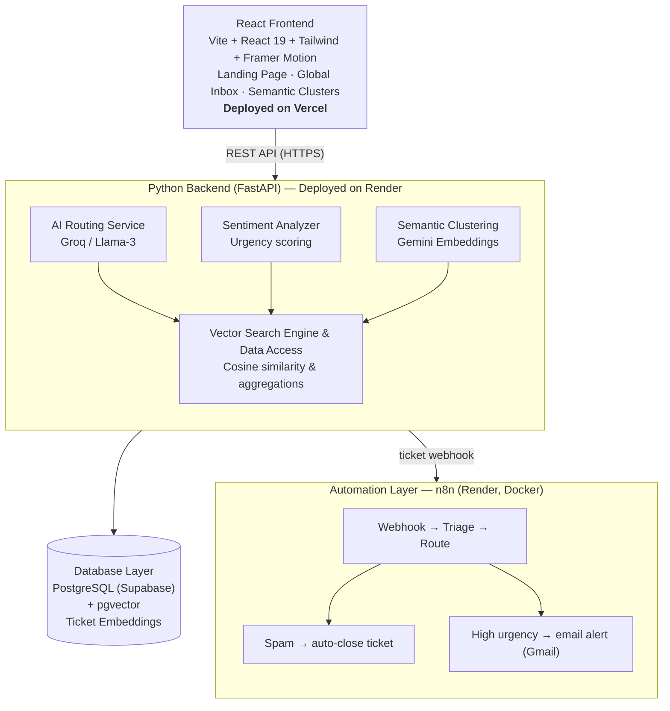

# Nova: AI-Powered Engineering Ticket Triage 🚀

Nova is a comprehensive, intelligent platform designed to unify and triage engineering support tickets across multiple sources (starting with GitHub, extensible to Zendesk, Jira, Intercom, etc.). By leveraging AI-driven classification, semantic clustering, and workflow automation, Nova helps engineering teams cut through the noise and focus on what truly matters: resolving critical issues and shipping features.

## 🔗 Live Deployment

| Service | URL | Hosted On |
|---|---|---|
| **App (Frontend)** | [ai-ticket-triage-nine.vercel.app](https://ai-ticket-triage-nine.vercel.app) | Vercel |
| **API (Backend)** | [ai-ticket-triage-2gwr.onrender.com](https://ai-ticket-triage-2gwr.onrender.com) | Render |
| **Automation Engine** | [n8n-te3z.onrender.com](https://n8n-te3z.onrender.com) | Render (n8n, Docker image) |
| **Database** | Managed PostgreSQL with `pgvector` | Supabase |

## 🏗️ Architecture

## 🎯 The Problem

Engineering teams are constantly bombarded by bug reports, feature requests, and support tickets from a wide variety of disconnected platforms. This fragmentation leads to:
- **Redundant Work**: The same underlying bug is often reported multiple times across different platforms.
- **Lost Context**: Support teams and engineers lack a unified view of an issue's true scope and urgency.
- **Manual Overhead**: Triaging, categorizing, and assigning tickets manually is an error-prone, time-consuming process that distracts engineers from building.

## 💡 The Solution (How it Works)

Nova solves this by acting as a **Universal Semantic Inbox** with an automated response layer.

1. **Ingestion**: The FastAPI backend ingests tickets — currently via a live GitHub Issues sync (`/api/integrations/github/sync`), pulling and processing real issues from any public repo on demand.
2. **AI Enrichment**: Each ticket is analyzed by an LLM (Groq / Llama-3) to extract its summary, determine its category (`bug`, `feature`, `question`, `spam`), assess urgency (`low`, `medium`, `high`), and calculate a sentiment score.
3. **Semantic Embeddings**: Each ticket's text is embedded via Google Gemini and stored in PostgreSQL using `pgvector`, enabling cosine-similarity search to surface related/duplicate tickets (`/api/tickets/{id}/similar`).
4. **Automated Triage (n8n)**: Every new ticket fires a webhook to a dedicated n8n workflow, which:
   - Automatically closes tickets classified as `spam` via the backend's `/ignore` endpoint — no human involvement needed.
   - Sends a real-time email alert (via Gmail) for any ticket flagged `urgency: high`, so nothing critical sits unnoticed.
5. **Dynamic Interface**: A glassmorphic React/Vite frontend (Framer Motion + Velora UI components) provides a real-time, unified dashboard to view tickets, monitor global metrics, and drill into clusters and details.

## 🚀 Features

- **Global Inbox**: One unified view for all tickets, regardless of origin.
- **Automated Categorization**: Real-time AI classification of urgency, category, and sentiment.
- **Semantic Similarity Search**: `pgvector`-powered lookup of related issues per ticket.
- **Automated Workflows (n8n)**: Spam auto-closure and urgent-ticket email alerts, fully configurable from the app's Automations page.
- **Analytics Dashboard**: Real-time visualization of ticket volume, sentiment trends, and urgency distribution.
- **Dark Aurora Theme**: A premium, animated UI designed for focus and clarity.

## 🧱 Tech Stack

- **Frontend**: React 19, Vite, TypeScript, Tailwind CSS, Framer Motion, Recharts — deployed on Vercel
- **Backend**: FastAPI, SQLAlchemy, Alembic — deployed on Render
- **Database**: PostgreSQL + `pgvector` extension — hosted on Supabase (accessed via the IPv4-compatible connection pooler)
- **AI**: Groq (Llama-3) for ticket classification, Google Gemini for text embeddings
- **Automation**: n8n (self-hosted Docker image on Render) for webhook-driven triage and email notifications
- **Ingestion**: GitHub REST API (public, no auth required)

## 🔮 Future Improvements (With More Time)

1. **Two-Way Sync**: Push status updates and engineer comments directly back to source platforms (e.g., closing the GitHub issue automatically closes the linked ticket in Nova).
2. **AI-Drafted Responses**: Auto-generate initial response drafts based on a ticket's semantic neighbors and internal documentation.
3. **Authentication & RBAC**: Add secure logins, team management, and role-based access control.
4. **Broader Automation Coverage**: Extend the n8n workflow beyond spam/urgent branches to route `medium`-urgency tickets and category-specific notifications (e.g., feature requests to product, bugs to on-call).
5. **Webhooks Over Polling**: Move ticket ingestion from on-demand GitHub sync to real-time webhook-driven ingestion, and add native connectors for Zendesk, Jira, and Intercom.
6. **Resilience on Free-Tier Hosting**: Add a lightweight uptime pinger (or upgrade off free tier) to keep the n8n service warm, avoiding cold-start delays on time-sensitive alerts.
7. **Performance Optimization**: Lazy-load heavy background animations or provide a "reduced motion" mode for lower-end devices.
